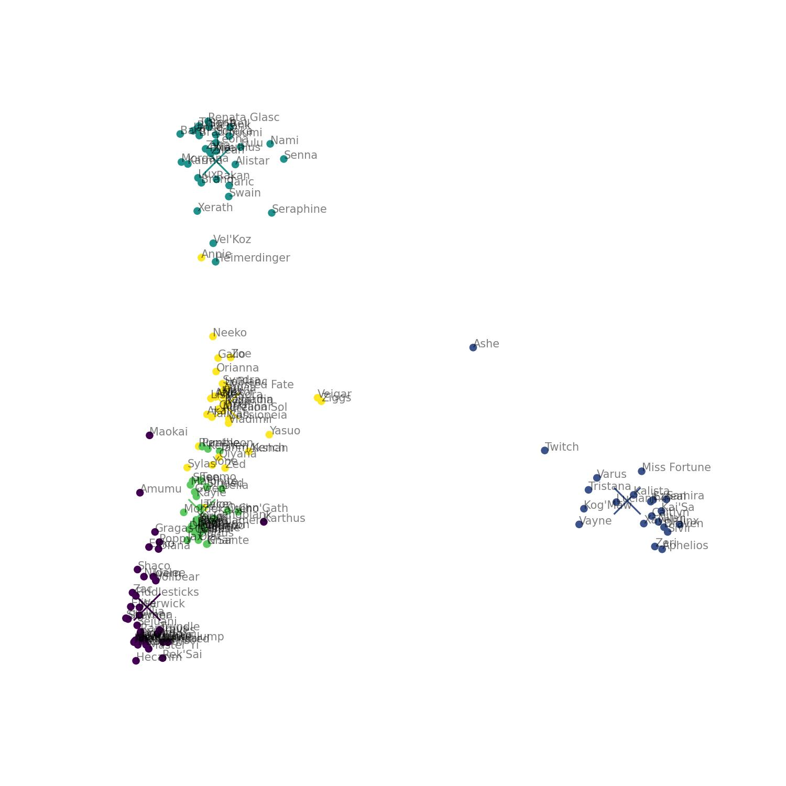

# League champion position clustering

Python Jupyter notebook for League of Legends unsupervised clustering champions clustering by positions

## Method used

The idea is that, with enough games examples, we can infer the meta position of a champion, by assuming that each game will have one champion for each role.

## Purpose

Trying to allows us to automatically find the champion's meta position-s for each patch with the only input being games.

## PCA

Using PCA to visually represent the champions vectors and the cluster centers

## Thanks

- thanks to @damianpetroff for helping me on this problem